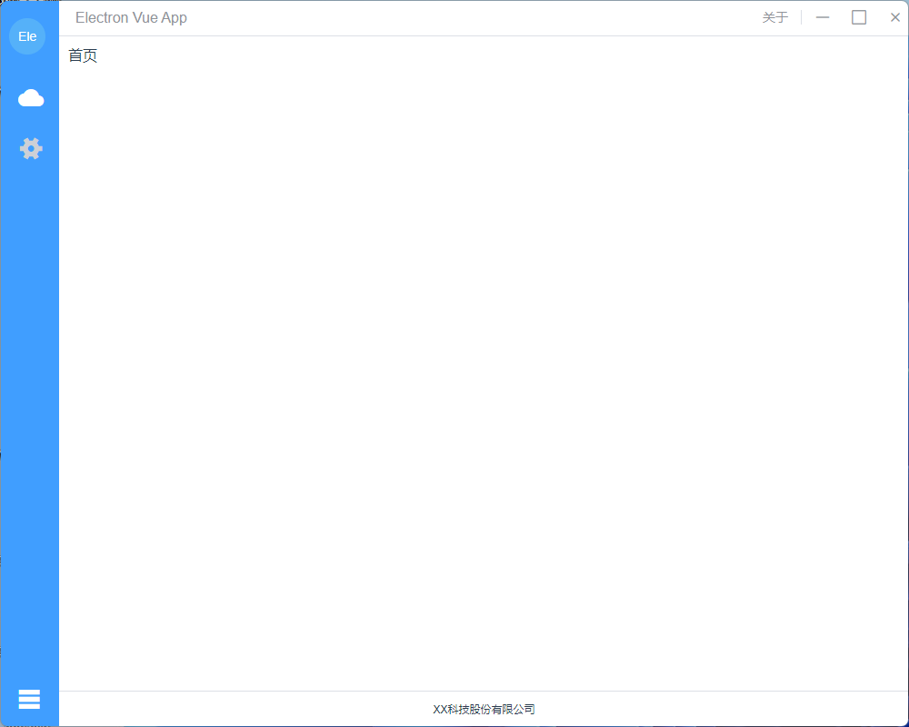

# Electron + Vue 3 + Element Plus 版本

该源码可帮助你快速开始一个 Electron + Vue 3 的项目，采用 Vue 3 `<script setup>`风格

Electron 地址：[https://www.electronjs.org/](https://www.electronjs.org/)

Vue 地址：[https://cn.vuejs.org](https://cn.vuejs.org/)

Element Plus 地址：[https://element-plus.gitee.io](https://element-plus.gitee.io/)

码云地址：[https://gitee.com/agafonov/electron-vue-app](https://gitee.com/agafonov/electron-vue-app/)

GitHub 地址：[https://github.com/yangdaichun/electron-vue-app](https://github.com/yangdaichun/electron-vue-app/)

# Tauri + Vue 3 + Element Plus 版本

码云地址：[https://gitee.com/agafonov/tauri-vue-app](https://gitee.com/agafonov/tauri-vue-app/)

GitHub 地址：[https://github.com/yangdaichun/tauri-vue-app](https://github.com/yangdaichun/tauri-vue-app/)

程序效果

